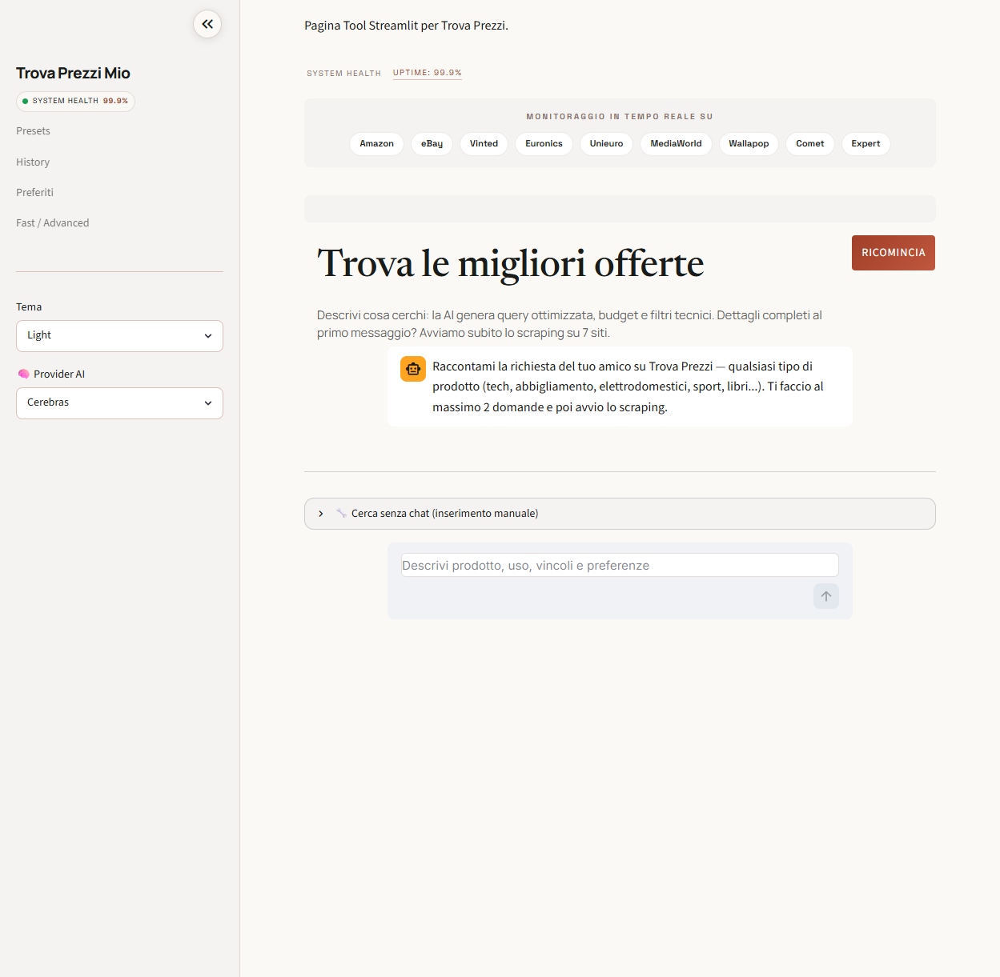

# 🛒 Trova Prezzi Mio

> AI-assisted price-comparison tool that scrapes Italian e-commerce sites in parallel and recommends the best deal through a conversational interface — with a **pluggable AI backend** (Cerebras, Groq, OpenAI, OpenRouter, Anthropic, Google Gemini).

[](https://github.com/DiegoRiccardi1234/trova-prezzi/actions/workflows/ci.yml)


[](https://github.com/astral-sh/ruff)


**🌐 Live demo:** [trova-prezzi.streamlit.app](https://trova-prezzi.streamlit.app/)

**[🇬🇧 English](#-english) · [🇮🇹 Italiano](#-italiano)**



---

## 🇬🇧 English

Describe what you want in plain language — the AI turns it into an optimized query, budget and technical filters, then scrapes up to 14 sources in parallel and ranks the results. A built-in chat recommends which product to buy and why.

### ✨ Features

- **Conversational search** — an LLM extracts query, budget and hardware specs from a free-text request, then auto-generates a ranked top-3 recommendation.
- **Pluggable multi-provider AI** — switch the LLM backend at runtime from the sidebar: **Cerebras, Groq, OpenAI, OpenRouter, Anthropic (Claude), Google Gemini**. Set the key of any provider you own; the best available model is picked dynamically.
- **14 scrapers in parallel** — Amazon, eBay, Vinted, Euronics, Unieuro, MediaWorld, Trovaprezzi, Wallapop, Comet, Expert, Subito, AliExpress, Temu, Alibaba — aggregated, de-duplicated and price-ranked.
- **Watchlist** — save products and review them later.
- **Price history + alerts** — tracks the minimum price per query over time and flags new lows / below-threshold deals.
- **Persistent search cache** — disk-backed with TTL, to cut repeated scraping and rate-limits.
- **Light & dark mode**, CSV export, side-by-side comparison, Amazon price history.
- **Auto-update** — local installs check GitHub for a newer release and update with one click.

### 🚀 Quickstart

**A. Hosted demo** — deploy `app.py` from the repo on [share.streamlit.io](https://share.streamlit.io), then add your keys under *Settings → Secrets* (template in [`.streamlit/secrets.toml.example`](.streamlit/secrets.toml.example)).

**B. Docker** (recommended for local real use):
```bash
cp .streamlit/secrets.toml.example .streamlit/secrets.toml   # then fill in your keys
docker compose up --build
# open http://localhost:8501
```

**C. Local (no Docker):**
```bash
run.bat          # Windows
./run.sh         # macOS / Linux
```
The script creates a virtualenv, installs dependencies and launches the UI on `http://localhost:8501`.

### 🔑 Configuration

Copy `.streamlit/secrets.toml.example` to `.streamlit/secrets.toml`. Everything is optional — scraping works without any key (AI features just stay off). Set `AI_PROVIDER` and the key(s) of the provider(s) you want; the sidebar lets you switch among the configured ones.

| Provider | Secret | Get a key |
|---|---|---|
| Cerebras (default) | `CEREBRAS_API_KEY` | https://cloud.cerebras.ai |
| Groq | `GROQ_API_KEY` | https://console.groq.com |
| OpenAI | `OPENAI_API_KEY` | https://platform.openai.com |
| OpenRouter | `OPENROUTER_API_KEY` | https://openrouter.ai |
| Anthropic (Claude) | `ANTHROPIC_API_KEY` | https://console.anthropic.com |
| Google Gemini | `GEMINI_API_KEY` | https://aistudio.google.com |

Other settings: `APP_PASSWORD` (dashboard login), `EBAY_APP_ID` / `EBAY_CERT_ID` (eBay Browse API).

### 🖥️ CLI

A command-line entry point complements the web UI:
```bash
python offerte_tech.py -q "notebook 14 16gb" -b 800 -n 5 --condizione nuovo
python offerte_tech.py -q "ssd 1tb" --export csv --output deals.csv
python offerte_tech.py -q "mouse" --provider groq        # choose the AI backend
```
`--provider` (or the `AI_PROVIDER` env var) selects the LLM backend for the AI
features and drives the **whole engine** — CLI, orchestrator and UI alike, not
just the sidebar.

### 🧱 Architecture

```
offerte/      core engine — scrapers, orchestrator, AI, parsing, dedup, providers, cache, config
ui/           Streamlit UI — auth, search flow, cards, comparison, recommendation
app.py        entry point (page config, auth gate, render flow)
updater.py, watchlist.py, price_history.py, search_history.py   features & persistence
tests/        unit suite (monkeypatched) + Playwright E2E
```
The LLM backend is abstracted in [`offerte/providers.py`](offerte/providers.py): OpenAI-compatible providers share one client, while Anthropic and Gemini are wrapped in thin adapters exposing the same interface — so the rest of the codebase is provider-agnostic. See [`CLAUDE.md`](CLAUDE.md) for the full module map.

### ✅ Tests & CI

```bash
pytest tests/ -k "not playwright"     # fast offline unit + feature suite
pytest tests/                          # full suite incl. Playwright E2E
ruff check . && ruff format --check .  # lint + format
mypy offerte ui                        # type-check (advisory)
```
GitHub Actions runs three jobs on every push and PR: **lint** (ruff, blocking),
**type-check** (mypy, advisory) and **test** (full offline suite). See
[`SECURITY.md`](SECURITY.md) and [`CHANGELOG.md`](CHANGELOG.md).

### 🛠️ Tech stack

Python 3.11 · Streamlit · BeautifulSoup / requests · Playwright · ThreadPoolExecutor · Cerebras / OpenAI / Anthropic / Google SDKs · pytest. Licensed under [MIT](LICENSE).

---

## 🇮🇹 Italiano

Descrivi cosa cerchi in linguaggio naturale — l'AI lo trasforma in query ottimizzata, budget e filtri tecnici, poi fa scraping di 14 fonti in parallelo e ordina i risultati. Una chat integrata consiglia quale prodotto comprare e perché.

### ✨ Funzionalità

- **Ricerca conversazionale** — un LLM estrae query, budget e specifiche da una richiesta in testo libero e genera in automatico una raccomandazione top-3.
- **AI multi-provider modulare** — cambia il backend LLM al volo dalla sidebar: **Cerebras, Groq, OpenAI, OpenRouter, Anthropic (Claude), Google Gemini**. Imposti la chiave del provider che hai; il modello migliore disponibile è scelto dinamicamente.
- **14 scraper in parallelo** — Amazon, eBay, Vinted, Euronics, Unieuro, MediaWorld, Trovaprezzi, Wallapop, Comet, Expert, Subito, AliExpress, Temu, Alibaba — aggregati, deduplicati e ordinati per prezzo.
- **Preferiti** — salva i prodotti e riguardali dopo.
- **Storico prezzi + alert** — traccia il prezzo minimo per query nel tempo e segnala nuovi minimi / offerte sotto soglia.
- **Cache ricerche persistente** — su disco con TTL, per ridurre scraping ripetuto e rate-limit.
- **Modalità chiara e scura**, export CSV, confronto fianco a fianco, storico prezzi Amazon.
- **Auto-update** — le installazioni locali controllano GitHub e si aggiornano con un click.

### 🚀 Avvio rapido

**A. Demo online** — fai il deploy di `app.py` dal repo su [share.streamlit.io](https://share.streamlit.io), poi aggiungi le chiavi in *Settings → Secrets* (template in [`.streamlit/secrets.toml.example`](.streamlit/secrets.toml.example)).

**B. Docker** (consigliato per uso reale in locale):
```bash
cp .streamlit/secrets.toml.example .streamlit/secrets.toml   # poi compila le chiavi
docker compose up --build
# apri http://localhost:8501
```

**C. Locale (senza Docker):**
```bash
run.bat          # Windows
./run.sh         # macOS / Linux
```
Lo script crea la virtualenv, installa le dipendenze e avvia la UI su `http://localhost:8501`.

### 🔑 Configurazione

Copia `.streamlit/secrets.toml.example` in `.streamlit/secrets.toml`. Tutto è opzionale — lo scraping funziona senza chiavi (le funzioni AI restano spente). Imposta `AI_PROVIDER` e la/le chiave/i del provider che vuoi; dalla sidebar scegli tra quelli configurati. (Tabella provider sopra.)

Altri valori: `APP_PASSWORD` (password dashboard), `EBAY_APP_ID` / `EBAY_CERT_ID` (eBay Browse API).

### 🖥️ CLI

Oltre alla UI web c'è un entry point da riga di comando:
```bash
python offerte_tech.py -q "notebook 14 16gb" -b 800 -n 5 --condizione nuovo
python offerte_tech.py -q "ssd 1tb" --export csv --output deals.csv
python offerte_tech.py -q "mouse" --provider groq        # scegli il backend AI
```
`--provider` (o la env `AI_PROVIDER`) sceglie il backend LLM per le funzioni AI
e guida **tutto il motore** — CLI, orchestrator e UI, non solo la sidebar.

### ✅ Test e CI

```bash
pytest tests/ -k "not playwright"     # suite unit + feature, offline
pytest tests/                          # suite completa con E2E Playwright
ruff check . && ruff format --check .  # lint + formato
mypy offerte ui                        # type-check (advisory)
```
GitHub Actions esegue tre job a ogni push/PR: **lint** (ruff, bloccante),
**type-check** (mypy, advisory) e **test** (suite offline completa). Vedi
[`SECURITY.md`](SECURITY.md) e [`CHANGELOG.md`](CHANGELOG.md).

### 🛠️ Stack

Python 3.11 · Streamlit · BeautifulSoup / requests · Playwright · ThreadPoolExecutor · SDK Cerebras / OpenAI / Anthropic / Google · pytest. Licenza [MIT](LICENSE).
